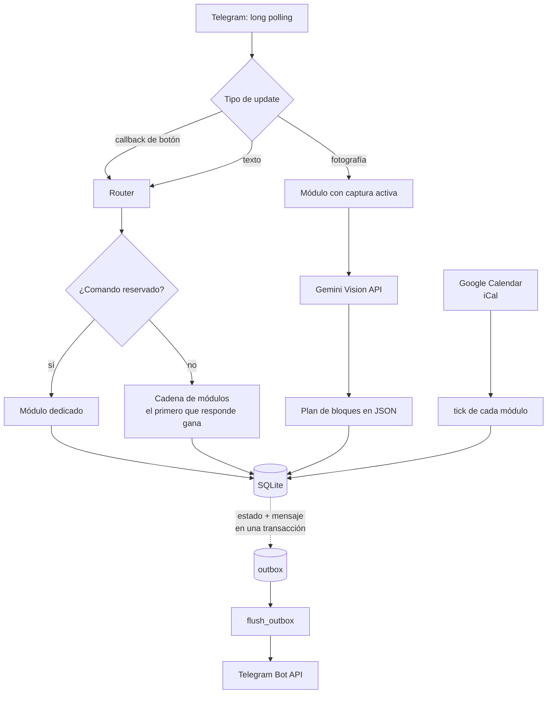

# Mástil

Asistente personal orientado a eventos, operado íntegramente desde Telegram.
Gestiona interrupciones graduadas, seguimiento de tareas con verificación
visual mediante IA, y temporización, sobre un único proceso Python **sin una
sola dependencia externa**.

---

## Qué problema resuelve

Las herramientas de productividad convencionales asumen que el problema es
recordar. En la práctica, el problema suele ser otro: **una notificación que
llega mientras la atención está capturada se descarta sin llegar a procesarse**.
El aviso se ve, se desliza, y diez minutos después no queda registro mental de
haberlo recibido. Subir el volumen no lo arregla — repetir el mismo aviso
entrena a ignorarlo.

Mástil ataca eso con **interrupciones graduadas**: la salida deja de ser un
botón (que el pulgar aprieta en piloto automático) y pasa a exigir una acción
que no se puede hacer sin mirar — leer un código de una imagen y transcribirlo.
La escalada sube en *exigencia*, no en cantidad, y tiene un techo explícito:
pasada una ventana determinada, el evento no se cancela ni se da por resuelto,
simplemente baja a una frecuencia mínima. Persistente, pero no infinito.

El segundo problema que resuelve es de **especificación**: una tarea difusa
("ordenar el escritorio") no tiene un primer paso, y por eso no se empieza.
El módulo de planificación toma una fotografía del entorno, la envía a un
modelo de visión y devuelve una secuencia de bloques concretos y ejecutables,
mostrando **uno a la vez**. El costo de decidir qué hacer se paga una vez, no
en cada paso.

---

## Stack técnico

| | |
|---|---|
| **Lenguaje** | Python 3.11+ |
| **Persistencia** | SQLite (15 tablas, sin ORM) |
| **Dependencias externas** | **ninguna** — sólo biblioteca estándar |
| **APIs** | Telegram Bot API · Gemini Vision API · Google Calendar (iCal + Apps Script) |
| **Despliegue** | VM Linux (Google Cloud) con `systemd` |
| **Pruebas** | 18 suites · 932 aserciones · reloj falso, sin sleeps reales |
| **Tamaño** | ~10.100 líneas de Python |

La ausencia de dependencias es una decisión de diseño, no una carencia. Está
documentada en `requirements.txt`: *una instalación sin dependencias es una
instalación que no se rompe sola*. Sus consecuencias son visibles en el código:

- Las imágenes PNG se **generan a mano** con `zlib` y `struct` — hay dos
  renderizadores, uno de siete segmentos y una tipografía de mapa de bits 5×7.
- Los reportes `.xlsx` se escriben con `zipfile` + XML, sin librerías de Office.
- Las llamadas HTTP van por `urllib`, sin SDK de proveedor.

---

## Arquitectura

El sistema es un **bucle de eventos de un solo hilo**. No hay framework, ni
cola de mensajes externa, ni workers.

```
   leer updates  →  enrutar  →  tick de cada módulo  →  vaciar la outbox
        ▲                                                      │
        └──────────────────────────────────────────────────────┘
```

Cada vuelta hace exactamente cuatro cosas:

1. **`read_updates()`** — *long polling* contra Telegram. La petición queda
   colgada hasta que llega un mensaje, así que el ritmo lo marca el evento y no
   un `sleep`.
2. **`router.process()`** — despacha el update al módulo correspondiente.
3. **`tick()`** — cada módulo revisa sus propios plazos contra el reloj.
4. **`flush_outbox()`** — recién acá se envía algo a Telegram.

### El patrón que sostiene todo: outbox transaccional

**Los módulos nunca hablan con Telegram.** Escriben una fila en la tabla
`outbox` dentro de la misma transacción en la que cambian su estado:

```python
with db.transaction():
    self._update(phase="insiste", next_at=iso(proximo))   # el estado
    self._say("Sigue pendiente.")                          # el mensaje
```

El envío real ocurre después del *commit*, en `runtime.flush_outbox()`.

Si el proceso muere en el medio, **o se guardaron las dos cosas o ninguna**.
Nunca se emite un aviso que el sistema cree no haber enviado, ni se pierde uno
que cree haber emitido. En un sistema cuyo trabajo es interrumpir en el momento
justo, "avisó dos veces" y "no avisó" son fallos equivalentes.

### Cómo se comunican los módulos

No se comunican directamente. Comparten tres cosas y nada más:

- **la base de datos**, donde cada módulo es dueño de sus propias tablas;
- **la `outbox`**, único canal de salida;
- **`core/scheduler.py`**, único lugar donde se decide *cuándo* pasa algo.

El aislamiento del scheduler es deliberado: es el único punto del proyecto
donde un error no se manifiesta como excepción sino como comportamiento
silenciosamente equivocado — insistir de más, de menos, o no insistir.

### El enrutador

`callback_data` de un botón **es el comando literal**. El botón `SIGUIENTE`
envía `/vigia_siguiente`, exactamente igual que si se hubiera tecleado. Sólo
los datos con prefijo `panel:` navegan, y ésos editan el mismo mensaje en vez
de encadenar mensajes nuevos.

Consecuencia práctica: **agregar un botón no requiere tocar el router**. Basta
con que el módulo declare el comando en su tupla `COMANDOS`.

---

## Flujo principal



---

## Módulos

Cada uno es un archivo plano en `modules/`, con dos puntos de entrada:
`handle_command()` para lo que llega del usuario y `tick()` para sus plazos.

| Módulo | Responsabilidad |
|---|---|
| `guardian` | Escalada graduada sobre eventos de calendario, con cola para los que vencen mientras el canal está ocupado |
| `vigia` | Planificación por bloques a partir de una fotografía analizada con IA |
| `panel` | Interfaz completa por teclados en línea; construye los comandos de los demás módulos |
| `timer` | Motor temporal con tres modalidades — cuenta atrás, hora fija y repetición acotada — sobre un único registro activo |
| `intervalos` | Cronómetro de vueltas: registra marcas y calcula tramos y totales |
| `pomodoro` | Ciclos de trabajo y descanso |
| `gmail` | Fricción deliberada sobre la revisión de correo, con límite diario |
| `lite` | Recordatorios para una usuaria asistida, con el contenido cifrado |
| `reporte` | Exportación a `.xlsx` generada sin librerías externas |
| `calendar_commands` | Alta de eventos vía puente de Apps Script |
| `system` | Estado, suspensión y utilidades de administración |

### Separación de responsabilidades

Una regla explícita evita que los módulos crezcan unos sobre otros:

> **Calendar** define acontecimientos programados. **Guardian** puede intervenir
> sobre ellos. **Vigía** gestiona tareas activas iniciadas explícitamente por el
> usuario. **Timer** únicamente genera señales temporales y no adquiere
> comportamiento de intervención por sí mismo.

---

## Integraciones

### Telegram Bot API — `integrations/telegram.py`

Canal único de entrada y salida. *Long polling* sobre `getUpdates`, teclados en
línea, edición de mensajes y envío de imágenes. Incluye los generadores de PNG
escritos a mano.

### Gemini Vision API — `integrations/vision.py`

Se invoca en exactamente **dos puntos** del sistema, y su contrato de salida es
siempre el mismo diccionario, pase lo que pase:

```python
{"decision": "APPROVED" | "REJECTED" | "TECHNICAL_ERROR",
 "approved": bool, "confidence": float, "reason": str}
```

Un fallo del modelo devuelve `TECHNICAL_ERROR` y **nunca destruye el estado de
la tarea**. El modelo interpreta imágenes; no decide plazos — eso es del
`scheduler`, de forma determinista.

### Google Calendar

Dos caminos separados:

- **Lectura:** un `.ics` público leído en cada `tick`. Los eventos se
  reconocen por prefijo (`**` y `++`).
- **Escritura:** un puente en Apps Script (`apps_script/calendar_bridge.gs`),
  autenticado por token e **inerte por defecto**.

---

## Instalación

```bash
git clone <url-del-repositorio>
cd mastil
cp .env.example .env
chmod 600 .env
```

No hay `pip install`: el proyecto sólo usa la biblioteca estándar.

Editar `.env` con las credenciales propias y validar sin conectarse a Telegram:

```bash
python3 main.py --check
```

Ese comando imprime la zona horaria efectiva, las rutas resueltas, qué
integraciones quedaron activas y las tablas creadas. Después:

```bash
python3 main.py --once     # una sola iteración
python3 main.py            # el bucle
```

### Variables de entorno

Todas llevan prefijo `MASTIL_`. Las imprescindibles:

| Variable | Descripción |
|---|---|
| `MASTIL_TELEGRAM_BOT_TOKEN` | Token del bot, de [@BotFather](https://t.me/BotFather) |
| `MASTIL_OWNER_CHAT_ID` | Chat autorizado a operar el sistema |
| `MASTIL_ICAL_URL` | URL del calendario en formato iCal |
| `MASTIL_TIMEZONE` | Zona IANA, p. ej. `America/Santiago` |

Opcionales, según qué integraciones se quieran activar:

| Variable | Descripción |
|---|---|
| `MASTIL_GEMINI_API_KEY` | Habilita el análisis de imágenes |
| `MASTIL_GEMINI_MODEL` | Modelo a usar |
| `MASTIL_CALENDAR_WEBAPP_URL` · `MASTIL_CALENDAR_TOKEN` | Puente de escritura a Calendar |
| `MASTIL_GMAIL_WEBAPP_URL` · `MASTIL_GMAIL_TOKEN` | Puente de lectura de correo |
| `MASTIL_LITE_USERS` | Usuarias asistidas, formato `chat_id:Nombre:Zona` |

El resto —duraciones, cadencias, umbrales— tiene valores por defecto y está
documentado en `.env.example`.

> **Ningún secreto vive en el código.** Todos se leen del entorno, y `.env`
> está en `.gitignore`.

---

## Pruebas

```bash
bash pruebas/correr.sh
```

18 suites, 932 aserciones, **deterministas**: reloj falso, dobles de Telegram y
de Gemini, y una base temporal que se destruye sola. No tocan servicios reales.

El patrón del reloj falso es lo que permite verificar un plazo de 70 minutos en
milisegundos:

```python
RELOJ = {"t": BASE}
sched.now_local = lambda: RELOJ["t"]
```

---

## Estructura

```
├── main.py                 punto de entrada (--check, --once)
├── config.py               configuración; TODAS las rutas derivan de __file__
├── database.py             SQLite, outbox, estado y migraciones aditivas
├── messages.py             todo el texto y los prompts, en un solo lugar
├── schema.sql              15 tablas
├── core/
│   ├── runtime.py          el bucle y la composición
│   ├── router.py           despacho de updates
│   └── scheduler.py        reglas de tiempo, deterministas
├── integrations/           Telegram · Calendar · Gmail · Vision
├── modules/                un archivo por módulo
├── scripts/                respaldo y migración
├── apps_script/            puente de Calendar (Google Apps Script)
└── pruebas/                18 suites con reloj falso
```

---

## Decisiones de diseño

**Todas las rutas derivan de `__file__`.** Ningún archivo contiene una ruta
absoluta, así que copiar la carpeta produce una instalación independiente y
montar un entorno de desarrollo es copiar y editar `.env`.

**Migraciones aditivas.** `CREATE TABLE IF NOT EXISTS` no agrega columnas a una
base existente; `database.migrate()` mantiene una lista de `_ensure_column()`
que se aplica al arrancar. Desplegar código con columnas nuevas no requiere
ningún paso manual.

**Un solo lugar para el texto.** Los 11 módulos no contienen cadenas visibles
al usuario: todas viven en `messages.py`, junto con los prompts del modelo.

**La zona horaria sale de la configuración, no del sistema operativo.** Se fija
una vez al arrancar; de lo contrario el mismo código agenda horas distintas
según la máquina donde corra.

---

## Licencia

MIT
